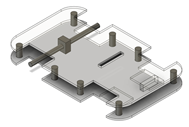
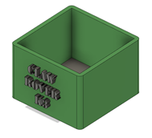
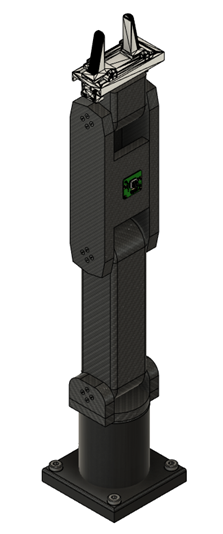
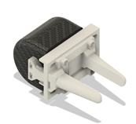
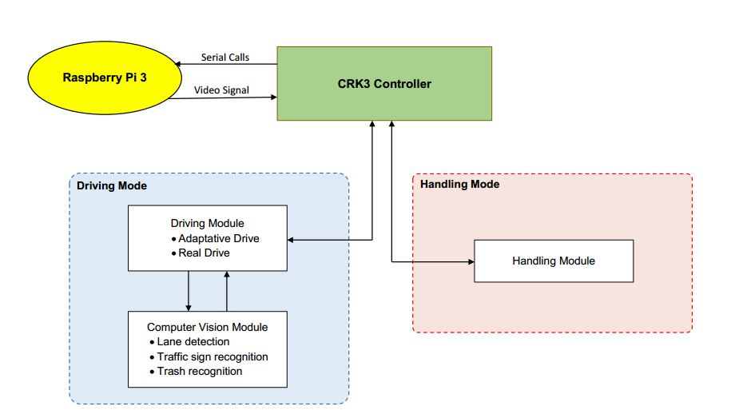
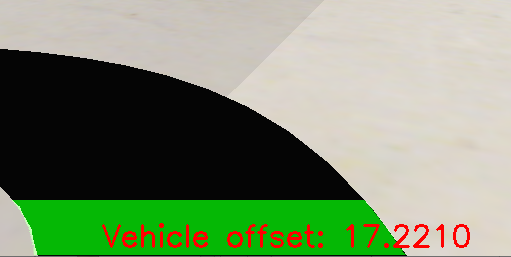
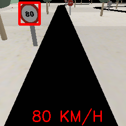
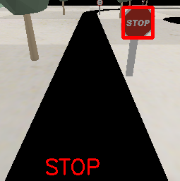

# Claw-Rover-K3
Project of a self-driving robot that collects trash along the road.

# Table of Contents
   * [What is this?](#What-is-this)
   * [Requirements](#Requirements)
   * [How to use](#How-to-use)
   * [Description](#Description)<!-- [Amazing contributions](#Amazing-contributions)-->
   * [Video](#video)
   * [Hardware Scheme](#Hardware-Scheme)   
   * [3D pieces](#3D-pieces)
   * [Software Architecture](#Software-Architecture)
     * [Computer Vision Module](#Computer-Vision-Module)
     * [Driving Module](#Driving-Module)
     * [Handling Module](#Handling-Module)
   * [Authors](#authors)

# What is this?
We are a group of four Computer Engineering students. More specifically, we specialize in the branch of Computation. 
This project integrates knowledge that we have acquired throughout the degree, mixing disciplines such as Robotics, Computer Vision, Deep Learning, Artificial Intelligence, Mathematics...
The result of this work is in this repository, in the form of a self-driving robot which follows the road, while detecting any trash along the way. It collects all the trash it detects, effectively acting as an autonomous garbage truck.

The Claw Rover K3 (CRK3) project is based on two very clear motivations. First, we wanted to create a robot committed to the environment, capable of making the world a slightly cleaner planet. Secondly, we were very fascinated by autonomous driving systems, such as those of Tesla, and we wanted to take advantage of this project to study them in depth, to implement one satisfactorily and to be able to play and experiment with it.
From the union of these two great motivations, and from the ideas and the effort of the four members of the group, Claw Rover K3 was born.

# Requirements
- Python 3.9.x
- Numpy
- Matplotlib
- Pandas
- TensorFlow
- OpenCV
- Coppelia and Simulator

# How to use
1. Clone this repo.
> git clone https://github.com/guiuomsfont/Claw-Rover-K3.git
2. Install the required libraries.
3. Open one of the simulations.
4. Run setup.py.
5. Enjoy it!

# Description
In this project you will find the code, simulations and 3D designs of the parts of a robot developed from scratch, Claw-Rover-K3, which is able to drive autonomously and collect garbage previously detected using computer vision techniques. This robot consists, schematically, of an anthropomorphic arm located on a platform with four wheels (front-wheel drive). It is implemented with Coppelia simulator and, in case you want to carry it out in real life, the instructions dedicated to the movement of the simulation robot should be substituted by communication instructions from a Raspberry Pi board to an Arduino board. This is a necessary step in order to correctly interact with the hardware components of the robot, such as the wheels, the arm or the sensors.

Basically, the robot is able to, through a camera sensor, detect the road and adjust its speed, direction and position based on a PID controller. In addition, through the use of a neural network, you have the option of enabling traffic sign recognition, which is used to influence the robot's driving and influence its trajectory. While it is self-driving, it analyses each of the processed frames in order to find garbage and collect it. When it detects trash, the robot reduces its speed, stops to a halt, and using the same camera that is used to drive, it detects the exact position of the object, using inverse kinematics equations. Afterwards, it will use its claw to pick up the object and deposit it in the trash container.

# Video
Video showing all the functionalities of the project in this <a href="https://youtu.be/jCSkAflEXYQ">link</a> or clicking on the GIF below.

<!--
# Amazing contributions

The three most important contributions in which our robot stands up are:
- Entertainment for seniors:  it is designed to entertain the elderly, for whom robots are a whole new thing.
- Classic Game Automation, the brisca: we give life to a classic and mythical game like the brisca combining it with technology and having it be even more enjoyable.
- Voice recognition with human interaction: Designed to bring the user closer to the robot and allows them to communicate with it.
-->

# Hardware Scheme
This is the Hardware Scheme we planned for this project, within the 100€ budget. 

  * The Raspberry will be connected to the Arduino board which will allow us to have control of the actuators and receivers.
  * The camera will be connected to the Raspberry board so that it can analyze the environment and act accordingly.
  * The Shield 293 driver will be connected to the Arduino and will help us to control the 4 servomotors and the ultrasonic sensor.
  * The 4 servomotors will be connected to the Shield 293 controller to move the anthropomorphic arm.
  * The 2 500 rpm engines will be connected to the L293 controller to move the wheels of the vehicle.
  * The 12000 mAh Powerbank will connect to the Raspberry and Arduino boards to power them.
  * The 4 AA batteries will be used to power our engines.

Here is the <a href="https://github.com/guiuomsfont/Claw-Rover-K3/blob/main/Design/Hardware%20Components.txt">list</a> of hardware components with purchase links.

# 3D Pieces
The 3D parts that make up the structure of the robot have been designed so that they can be printed and implemented in reality without any problems or collisions with a 3D printer.

  * Main chassis of the car: PLA plastic base on which we will build all the architecture of the Claw Rover 3K.
  
  

  
  * Container (bin): A small container where the Claw Rover 3K will store the trash it collects.
  
  

  
  * Anthropomorphic arm joints (3): Articulated arm of the Claw Rover K3. It consists of 3 joints. When it detects debris, the Claw Rover 3K will approach it and calculate the appropriate arm position to pick it up. He will then move his arm to the appropriate position to leave the debris in the container.
  
  

  
  * Anthropomorphic arm claw: Articulated clamp located at the end of the arm, with which the Claw Rover 3K will pick up the pieces of trash.

  

# Software Architecture

 

 
Our software modules have all been programmed using the Python coding language. Conveniently, Python can easily be run on a Raspberry Pi 3, which is the board we are using in our robot. For testing purposes, we are using Coppelia Simulator, which can be interacted with through the Simulator library for Python. As we've already explained above, in order to run the robot in real life, the simulator methods should be substituted by the corresponding Serial calls to the Arduino board, which would then send the corresponding signals to the servos, as well as retrieve the frame signals from the camera sensor. 

Our robot is always running in one of two modes, the Driving Mode or the Handling Mode. As the name implies, the Driving Mode handles everything related to the self-driving feature of the car, including all the Computer Vision algorithms (lane detection, traffic sign recognition and trash detection), as well as the PID controller and the equations used to obtain the left and right servo speeds (Unicycle Model). On the other hand, the Handling Mode contains all the procedures related to the trash collection, including the computation of the trash coordinates, the inverse kinematics equations which are used to compute the angles for all the joints, and the commands used to pick up the object and place it inside the trash container. 

In order to have an optimal code structure, we have divided all the algorithms and procedures into 3 main modules: the Computer Vision module, the Driving module and the Handling module. The first two modules are used to run the robot in Driving Mode, and the Handling module is the one that is used in the Handling Mode. Now, let's run through all the modules:

## Computer Vision Module
This module contains all the algorithms and functions used to process the images being obtained through the camera sensor and to obtain necessary information required for the self-driving algorithm. These functionalities are the following:

1. **Lane detection**: In order to drive properly, the robot must know where it iss located within the road lane it is driving through. For that to be possible, we knew from the get-go that a robust lane detection algorithm was necessary for this project. When we initially research the state of the art, we found simple Hough Line lane detectors which are very fast and work really well in straight roads or roads with very gentle curves. When we tried our hand at coding one of those algorithms, we found that it was great for detecting the straight lines at each side of the road, so we tried to plug that algorithm into the simulator. The results were not what we expected, and the algorithm was having enormous trouble at detecting the road properly in our set piece. After doing some digging, we realized this happened because the Hough Line algorithm we were using was only capable of fitting straight lines. \
After seeing these results, we scrapped our first algorithm and looked for alternatives. Thankfully, we were able to find robust tried and tested curved lane detector techniques, and we started to follow multiple guides on how to program such algorithms. We finally settled on a combination of multiple simple but effective techniques. The         procedure is as follows:
    1. We process the image in the HSL color space. More precisely, we threshold the lightness channel and the saturation channel using Sobel, which detects horizontal changes in lightness and saturation, respectively. After that, we combine the two binary images to obtain a combined binary image which (hopefully) shows two clear lines. 
    2. Once we have the combined binary, we use an Homography transformation to get a bird's eye perspective of the road, which is very helpful when detecting lanes.
    3. We then compute a horizontal histogram of the bird's eye binary image, which clearly shows 2 peaks of color which correspond with the position of the lane edges.
    4. Using the 2 peaks obtained through the histogram, we use a sliding window algorithm which saves all the pixels it detects at each of the lines in two lists. After that is done, we now have all the pixels at the edge of the roads. We can now use the two lists to fit polynomial functions to the curves of the lane. 
    5. And we are done. We can now revert the perspective transformation we applied earlier, and we have our lane curves! 
The result is very satisfactory, as you can see below:

  After computing the lane edges, we can now use the two lines to compute the center of the lane, which will be used as our "ideal" position. When we have the ideal position, we can compute the offset between the robot and that position, which is the offset that will be used when computing the steering angle with the PID controller.

       
2. **Traffic sign recognition**: We also worked on a traffic sign detector, which we use to ensure that the robot follows the rules of circulation in the form of traffic signs. The algorithm is capable of cropping traffic signs out of the image, analyzing the data they contain and identifying which traffic sign class they belong to. In order to achieve this purpose, we built a neural network classifier which has been trained thoroughly to ensure good accuracy. \
The model is also robust in the sense that it does not take outliers into account. What this means is that if it reads eight 80 KPH speed limiter signs in a row, and one 30 KPH speed limiter sign in the middle of that sequence, it will discard the outlier, and it will output the 80 KPH speed limiter class. \
This algorithm contains an initial cropping algorithm that uses the color of the expected traffic signs to crop the frame so that all the information which does not belong to a traffic sign is discarded. \
Before classifying the traffic signs though, we needed to train the neural network. In order to do so, we manually ran the simulator multiple times and saved the frames that the robot was capturing to build a dataset.\
After that, we manually labelled all the images with the correct class of traffic sign that each one contained. With this dataset we were able to train the neural network, which was then ready to be used in our driving model.\
You can see the result of the classifier in the figures below:

3. **Trash recognition**: When we ran the simulation with both the lane detection algorithm and the sign traffic classifier, we realized that the performance of the simulator was going to be a problem. Our computers were running the simulation at no more than 20 frames per second. After realizing this, we decided that the most important feature of the trash recognition algorithm would be its compute efficiency. It was of paramount importance that the algorithm was able to run very fast, or otherwise we would be risking an erratic driving model. \
That being said, our trash detector uses a very fast blob detector algorithm which detects objects of a certain size at each side of the road. This works very well with our simulation, and it's also a very efficient algorithm to run, which means that the impact to the performance of the simulation is very small. 
      
## **Driving Module**
The Driving Module receives information from the Computer Vision Module and it computes the trajectory, speed and other such parameters in order to update the trajectory and speed of the robot. The goal of this module is to provide safe and smooth driving which also follows the law by reading traffic signs and acting accordingly. 

First and foremost, the Driving module uses the offset (Proportional), as well as the offset of the previous frame (Derivate), and the sum of offsets (Integral) parameters to compute the steering angle using a reliable PID controller. After tuning the parameters of this controller by trial and error, we settled on consistent and satisfactory parameters which ensure that the robot stays within the road and it drives in a smoothly manner. 

After modelling the PID controller, we realized that our robot would not be able to easily plug the steering angle into the wheels, because our wheels don't rotate in the vertical axis, meaning that we aren't able to directly change the steering angle. In order to solve this, we did some research on how to implement smooth driving with a Unicycle type vehicle. We quickly found the Unicycle Model, a model that contains a set of equations which compute the speed that each servo needs to adopt based on the desired steering angle and speed.

With the PID controller and the Unicycle Model the robot could already drive well. The last part of the Driving module contains the GoToTrash function, which is triggered in case the CV Module detects a piece of trash. The function is used to set the robot on a trajectory to the piece of trash. After it reaches that position, the robot changes the operating mode to the second one: the Handling mode. 

Before that though, we decided to implement two driving modes, the Adaptive Driving Mode and the Real Driving Mode:
1. **Adaptive Driving Mode**: The Adaptive Driving Mode is a faster, intuition-based driving model. This driving mode computes the speed of the robot based on the size of the offset. The bigger the offset, the lower the speed will be, because the model understands that its driving through a difficult part of the road, which usually means hard turns. On the other hand, in case the offset is lower, meaning the robot is very close to or at the ideal center point of the lane, the robot will accelerate, because it understands that it is easily driving in a smoothly manner. What this translates into in the simulator is that the robot will accelerate at the straights, and it will slow down at the corners, which translates to a safe and smooth driving style. 

2. **Real Driving Mode**: On the other hand, we implemented the Real Driving Mode, which computes its speed based on the speed limiter traffic signs it detects. What this means is that this mode is always following the speed that the authorities have declared as fit for that section of the road. In the simulator, this driving mode acts according to the traffic signs we placed around the track, which means that it stops when it reads a STOP sign, and it adopts the speeds that the traffic signs indicate at all times. 
          
## **Handling Module**
When the Handling mode is activated, the robot is already standing next to the piece of trash it has to collect. Therefore, the servos at the wheels are turned off during this mode.

Firstly, the arm of the robot moves to a position which allows the camera to see the object from above. After that, the camera detects the coordinates of the piece of trash. 

Then, through the use of inverse kinematics equations, the robot computes the angle that each joint needs to adopt in order to reach the object. Once that's done, the claw will close, and the arm will lift, picking up the object.

Finally, the object will be deposited in the trash container, which is used to store all the trash that Claw Rover K3 collects.

After all that is done, the robot will once again go back to the Driving Mode, and the cycle will keep repeating itself while there is trash to be collected.

# Authors

- [GUIU OMS FONT](https://github.com/guiuomsfont) - 1525686

- [QUIM CAMPRUBÍ CASAS](https://github.com/quimcamprubi) - 1528104

- [JOSEP BRAVO BRAVO](https://github.com/LeBrav) - 1526453

- [ARNAU JOSEP ALCÓN ACEDO](https://github.com//1529603) - 1529603
